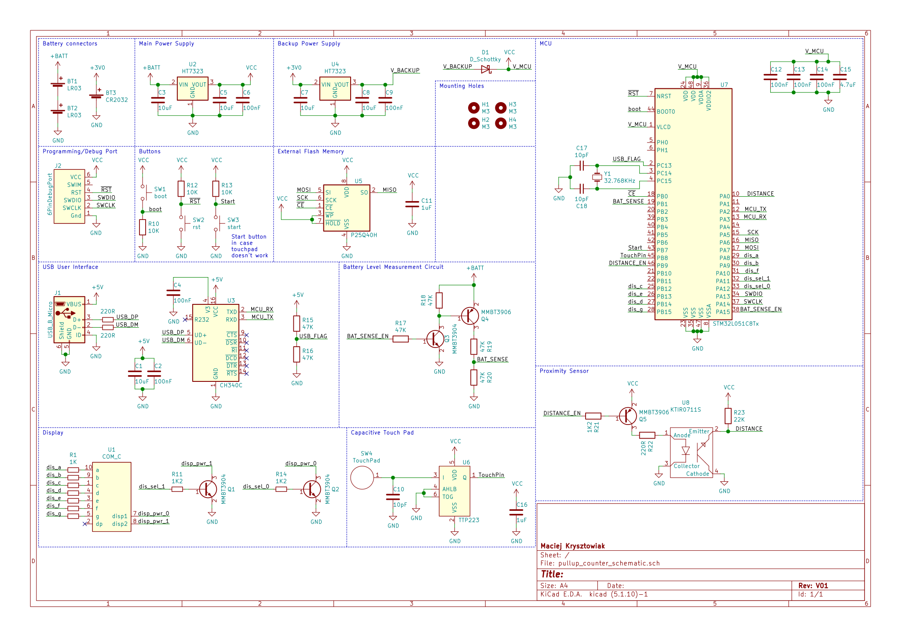
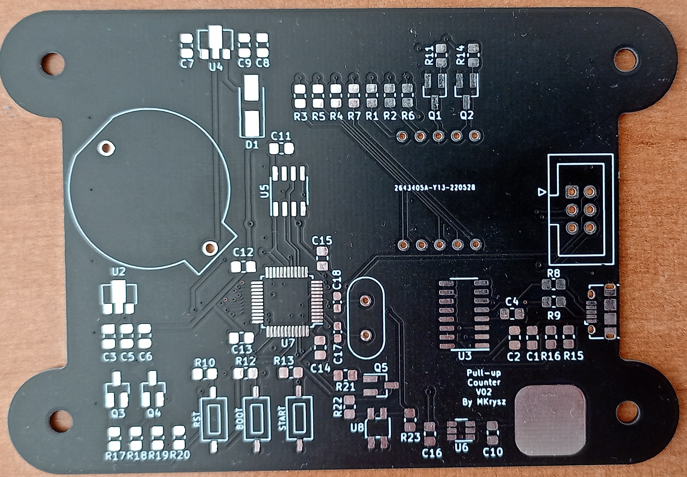
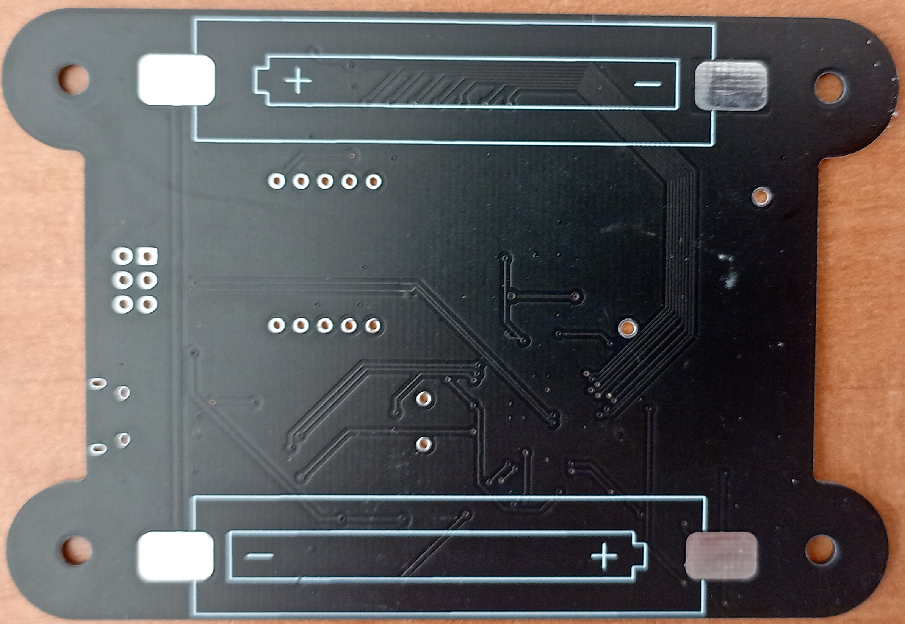
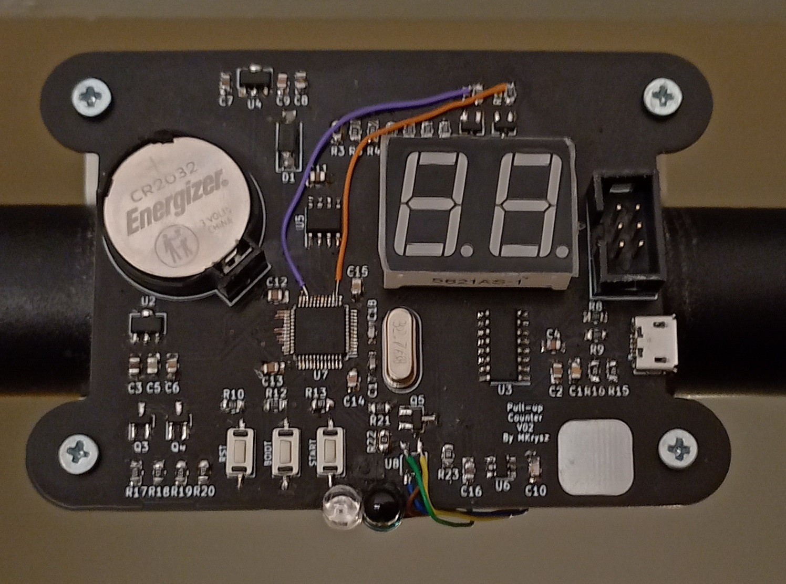
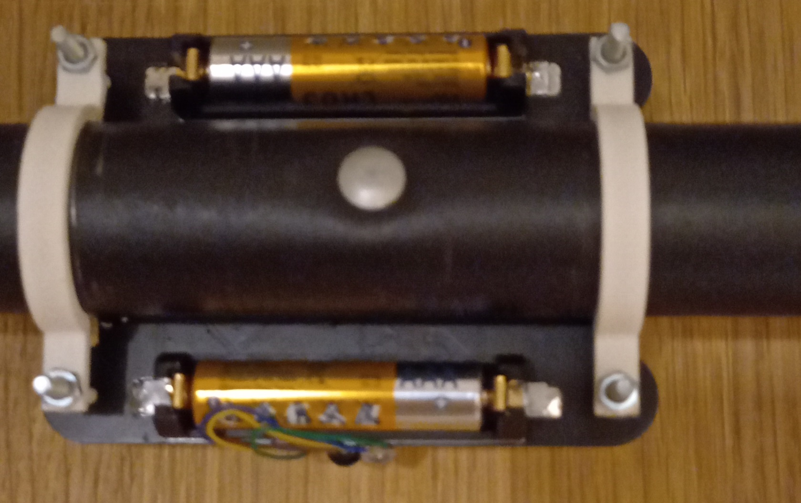
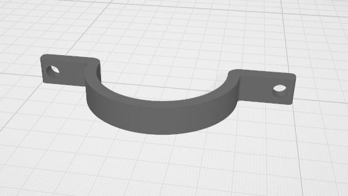
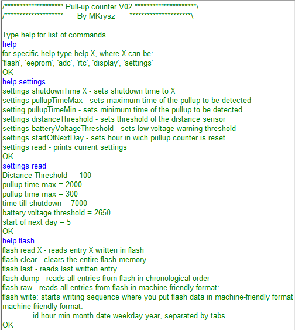
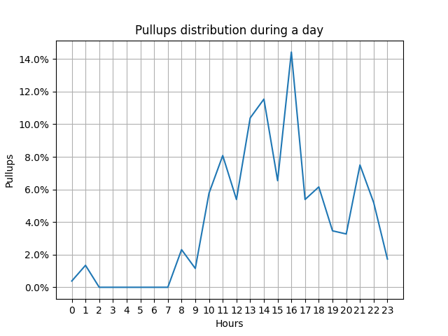

# PULLUP Counter

## About

The main purpose of the project was to automatically count and save the amount of pullups I make. I developed a small device mounted onto the bar that saves every pullup, shows how many were already done that day and has an USB interface for accessing the data and changing parameters of the device.

## Hardware

### PCB



Schematic and PCB was made in KiCad.

For the power supply I decided that 2 AAA batteries would be the best choice, as they're easily available and have good volumetric energy density. Embedding the Li-Po battery was out of the table, because the project is stationary and charging wouldn't be possible.

As the brain of the device I went with STM32L0 series microcontroller because of following reasons:

- low power consumption and low operating voltage, which is mandatory in battery operated systems like this
- my familiarity with developing both harware and software with this series
- affordable price.

I chose a STM32L051C8 as I had few of them lying around.

The MCU has a backup battery used for maintaining operation of RTC clock while main batteries are discharged or being replaced. The amount of pullups are displayed on 7 segment display as it's cheap, small and easy to drive. It's also perfect for displaying numbers which is all It's used here for. For a memory in which I would store my database i used a 512kB SPI Flash - P25Q40H. Communication with the device is done with USB serial port, so I included an USB port and USB-UART converter. I also included a capacitive touch pad and little sensor IC as a way to wake the device up. For detecting pullups I used proximity sesor consisting of IR Led diode and photodiode.

PCBs were manufactured by JLCPCB, and are shown below:



During soldering I found out that I'm out of SMD proximity sensors so I glued a THT one instead. Also, by accident, I soldered PNP transistors instead of NPN. After replacing the transistors I had to connect them to different pins of the MCU as the original ones were blown up.

After assembling and mounting it on the pullup bar:




### Mounting

Mounting is done using 3D-printed mounting system and four pairs of M3 bolts and nuts.



## Software

### Embedded

Project was made in VSCode using [stm32-for-vscode](https://github.com/bmd-studio/stm32-for-vscode) extension. For this project I used [stm32CubeMX](https://www.st.com/en/development-tools/stm32cubemx.html) for generating initialization. I've also used drivers for SPI flash memory from this [github repository](https://github.com/nimaltd/w25qxx).

The device must be woken up before every training session, which can be done either by physical btn or capacitive touch pad. After that if device haven't detected a pullup within specified time, it goes back to sleep to prolong battery life.

Every pullup is represented with following struct

```C

typedef struct _entry_struct
{
    uint16_t id_;

    uint8_t hour_;
    uint8_t minutes_;

    uint8_t month_;
    uint8_t date_;
    uint8_t weekday_;
    uint8_t year_;
} entry_t

```

Because each entry's size is 8B and my flash memory is 512kB the maximum amount of pullups that can be saved within the device is over 65 thousand

### USB User Interface

User interface allows the user for easy change of important parameters, debugging and downloading and  clearing data from device's flash memory. To put device in interface mode, plug it in your computer and restart it. The welcome message should appear. After that you can type 'help' for a list of available commands with short description.



### Data analysis

Python script that reads and interprets data acquired from the device. Below are shown examples of generated plots:

